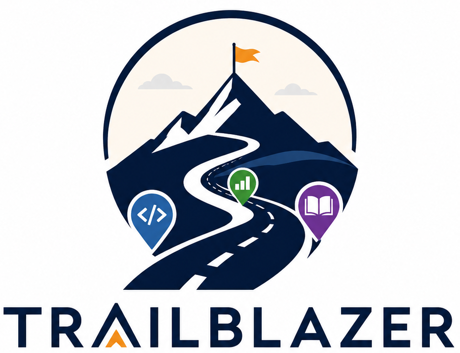

# 🧭 TrailBlazer — Find Your Career Path

> An AI-powered career roadmap generator for engineering students. Enter your branch, year, interests, and target role — get a personalized visual roadmap, skill gap analysis, project ideas, and a custom study plan. Built for the Creative Showcase Hackathon 2026.



---

## 🚀 Live Demo

👉 https://trailblazer-xo24.onrender.com/

---

## ✨ Features

- **🎯 Personalized Roadmap** — AI-generated career path based on your branch, year, skills, and target role
- **🎰 Slot Machine Persona Reveal** — fun animated reveal of your "Career Persona" (e.g. The Builder, The Algorithm Whisperer)
- **📊 Skill Gap Snapshot** — see exactly which skills you have vs. still need for your target role, by name
- **📚 Adaptive Resources** — links to specific learning resources for your missing skills; switches to next-step content when you're fully covered
- **🛠️ Project Ideas** — 3 concrete, buildable project suggestions tailored to your target role
- **📅 Study Plan Builder** — pick 1, 2, or 3 hours/day and get a week-by-week plan with break weeks and fun motivational lines
- **📋 Copy My Result** — one-click copy of your full roadmap as shareable text
- **⚡ Dual Autosuggest** — custom-built prefix search engine + bootcamp's multi-algorithm API (Brute Force, Binary Search, Trie) running silently in parallel
- **🔄 LLM + Fallback** — Groq LLM generates personalized roadmaps; rule-based fallback ensures the app never breaks

---

## 🛠️ Tech Stack

| Layer | Technology |
|---|---|
| Frontend | HTML, CSS, JavaScript |
| Backend | Node.js, Express |
| AI | Groq API (LLaMA 3.3 70B) |
| Autosuggest | Custom prefix-search engine + Bootcamp AutoSuggest API |
| Deployment | Render |

---

## 📁 Project Structure

```
TrailBlazer/
├── index.html          # Main frontend
├── logo.png            # App logo
├── css/
│   └── style.css       # All styles
├── js/
│   ├── app.js          # Main app logic
│   ├── autosuggest.js  # Custom autosuggest engine
│   ├── data.js         # Skills, roles, resources dataset
│   └── roadmap.js      # Rule-based fallback roadmap generator
└── backend/
    ├── server.js       # Express server + Groq LLM integration
    ├── package.json
    └── .env.example    # Environment variable template
```

---

## ⚙️ Run Locally

**1. Clone the repo**
```bash
git clone https://github.com/GeethaBurigalla/TrailBlazer.git
cd TrailBlazer
```

**2. Install dependencies**
```bash
cd backend
npm install
```

**3. Set up environment variables**
```bash
cp .env.example .env
# Open .env and add your Groq API key
```

**4. Start the server**
```bash
node server.js
```

**5. Open in browser**
```
http://localhost:6700
```

---

## 🔑 Environment Variables

| Variable | Description |
|---|---|
| `GROQ_API_KEY` | Your Groq API key — get one free at [console.groq.com](https://console.groq.com) |
| `PORT` | Port to run the server on (default: 6700) |

---

## 🎯 How It Works

1. Student enters their **branch**, **year of study**, **target role**, and **skills/interests**
2. Skills are powered by a **custom-built autosuggest engine** (prefix search over a curated dataset), running alongside the bootcamp's multi-algorithm API for comparison
3. On submit, the app calls the **Groq LLM** with a structured prompt to generate a personalized roadmap — if the LLM fails for any reason, a **rule-based fallback** generates a roadmap instantly
4. Results include a **Career Persona**, **4-stage roadmap**, **named skill gap**, **adaptive resources**, **project ideas**, and a **weekly study plan**

---

## 👩‍💻 Built By

**Geetha Burigalla** — Pre-final year B.Tech CSE student at BVRIT  
GitHub: [@GeethaBurigalla](https://github.com/GeethaBurigalla)

---

## 📄 License

MIT License — feel free to use, modify, and build on this!
